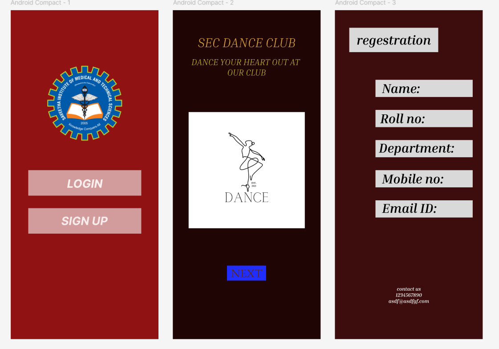

# Ex09 Event Registration Web Application
## Date:22/12/2025

## AIM:
To design, develop and deploy a web application for event registration.

## DESIGN STEPS:

### Step 1:
Create a new frame.

### Step 2:
Select any one preset size of your choice.

### Step 3:
Select the shapes you need.

### Step 4:
Import images as needed.

### Step 5:
Create pages based on your need and link them.

### Step 6:

Validate the HTML and CSS code.

### Step 6:

Publish the website in the given URL.

## DESIGN TOOL:
Figma

## CODE:

```
html
<!DOCTYPE html>
<html>
  <head>
    <meta name="viewport" content="width=device-width, initial-scale=1" />
    <meta charset="utf-8" />
    <link rel="stylesheet" href="globals.css" />
    <link rel="stylesheet" href="style.css" />
  </head>
  <body>
    <div class="frame">
      <div class="android-compact">
        <div class="rectangle"></div>
        <div class="div"></div>
        <div class="text-wrapper">SIGN UP</div>
        <div class="text-wrapper-2">LOGIN</div>
        
      </div>
    </div>
  </body>
</html>

css
.frame {
  width: 100%;
  min-width: 412px;
  min-height: 917px;
  display: flex;
}

.frame .android-compact {
  width: 412px;
  height: 917px;
  position: relative;
  background-color: #8f1111;
}

.frame .rectangle {
  top: 446px;
  position: absolute;
  left: calc(50.00% - 157px);
  width: 315px;
  height: 71px;
  background-color: #d19b9b;
}

.frame .div {
  top: 552px;
  position: absolute;
  left: calc(50.00% - 157px);
  width: 315px;
  height: 71px;
  background-color: #d19b9b;
}

.frame .text-wrapper {
  position: absolute;
  top: 568px;
  left: calc(50.00% - 65px);
  font-family: "Inter-BoldItalic", Helvetica;
  font-weight: 700;
  font-style: italic;
  color: #f7ebeb;
  font-size: 32px;
  letter-spacing: 0;
  line-height: normal;
}

.frame .text-wrapper-2 {
  position: absolute;
  top: 464px;
  left: calc(50.00% - 49px);
  font-family: "Inter-BoldItalic", Helvetica;
  font-weight: 700;
  font-style: italic;
  color: #fff0f0;
  font-size: 32px;
  letter-spacing: 0;
  line-height: normal;
}

.frame .image {
  position: absolute;
  top: 149px;
  left: calc(50.00% - 110px);
  width: 220px;
  height: 220px;
  aspect-ratio: 1;
  object-fit: cover;
}

html
<!DOCTYPE html>
<html>
  <head>
    <meta name="viewport" content="width=device-width, initial-scale=1" />
    <meta charset="utf-8" />
    <link rel="stylesheet" href="globals.css" />
    <link rel="stylesheet" href="style.css" />
  </head>
  <body>
    <div class="frame">
      <div class="android-compact">
        <div class="text-wrapper">SEC DANCE CLUB</div>
        <p class="DANCE-YOUR-HEART-OUT">DANCE YOUR HEART OUT AT <br />OUR CLUB</p>
        <div class="rectangle"></div>
        <div class="div">NEXT</div>
      </div>
    </div>
  </body>
</html>

css
.frame {
  width: 100%;
  min-width: 412px;
  min-height: 917px;
  display: flex;
}

.frame .android-compact {
  width: 412px;
  height: 917px;
  position: relative;
  background-color: #200505;
}

.frame .text-wrapper {
  position: absolute;
  top: 68px;
  left: 0;
  width: 412px;
  font-family: "Inria Serif-LightItalic", Helvetica;
  font-weight: 300;
  font-style: italic;
  color: #d79f38;
  font-size: 36px;
  text-align: center;
  letter-spacing: 0;
  line-height: normal;
}

.frame .DANCE-YOUR-HEART-OUT {
  position: absolute;
  top: 129px;
  left: calc(50.00% - 152px);
  width: 303px;
  font-family: "Inria Serif-LightItalic", Helvetica;
  font-weight: 300;
  font-style: italic;
  color: #cabc25;
  font-size: 24px;
  text-align: center;
  letter-spacing: 0;
  line-height: normal;
}

.frame .rectangle {
  position: absolute;
  top: 712px;
  left: calc(50.00% - 55px);
  width: 109px;
  height: 42px;
  background-color: #1f2eff;
}

.frame .div {
  position: absolute;
  top: 712px;
  left: 162px;
  font-family: "EB Garamond-Regular", Helvetica;
  font-weight: 400;
  color: #5a2929;
  font-size: 32px;
  letter-spacing: 0;
  line-height: normal;
}

html
<!DOCTYPE html>
<html>
  <head>
    <meta name="viewport" content="width=device-width, initial-scale=1" />
    <meta charset="utf-8" />
    <link rel="stylesheet" href="globals.css" />
    <link rel="stylesheet" href="style.css" />
  </head>
  <body>
    <div class="frame">
      <div class="android-compact">
        <div class="rectangle"></div>
        <div class="text-wrapper">regestration</div>
        <div class="div"></div>
        <div class="rectangle-2"></div>
        <div class="text-wrapper-2">Name:</div>
        <div class="rectangle-3"></div>
        <div class="rectangle-4"></div>
        <div class="rectangle-5"></div>
        <div class="text-wrapper-3">Mobile no:</div>
        <div class="text-wrapper-4">Email ID:</div>
        <div class="text-wrapper-5">Department:</div>
        <div class="text-wrapper-6">Roll no:</div>
        <div class="contact-us">contact us<br />1234567890<br />asdf@asdfgf.com</div>
      </div>
    </div>
  </body>
</html>

css
.frame {
  width: 100%;
  min-width: 412px;
  min-height: 917px;
  display: flex;
}

.frame .android-compact {
  width: 412px;
  height: 917px;
  position: relative;
  background-color: #3c0b0b;
}

.frame .rectangle {
  top: 49px;
  left: 40px;
  width: 248px;
  height: 68px;
  position: absolute;
  background-color: #d9d9d9;
}

.frame .text-wrapper {
  position: absolute;
  top: 61px;
  left: calc(50.00% - 146px);
  font-family: "Inria Serif-BoldItalic", Helvetica;
  font-weight: 700;
  font-style: italic;
  color: #000000;
  font-size: 36px;
  text-align: center;
  letter-spacing: 0;
  line-height: normal;
  white-space: nowrap;
}

.frame .div {
  top: 194px;
  left: 113px;
  width: 271px;
  height: 48px;
  position: absolute;
  background-color: #d9d9d9;
}

.frame .rectangle-2 {
  top: 530px;
  left: 113px;
  width: 271px;
  height: 48px;
  position: absolute;
  background-color: #d9d9d9;
}

.frame .text-wrapper-2 {
  position: absolute;
  top: 196px;
  left: 131px;
  font-family: "Inria Serif-BoldItalic", Helvetica;
  font-weight: 700;
  font-style: italic;
  color: #000000;
  font-size: 36px;
  text-align: center;
  letter-spacing: 0;
  line-height: normal;
  white-space: nowrap;
}

.frame .rectangle-3 {
  top: 446px;
  left: 113px;
  width: 271px;
  height: 48px;
  position: absolute;
  background-color: #d9d9d9;
}

.frame .rectangle-4 {
  top: 362px;
  left: 113px;
  width: 271px;
  height: 48px;
  position: absolute;
  background-color: #d9d9d9;
}

.frame .rectangle-5 {
  top: 278px;
  left: 113px;
  width: 271px;
  height: 48px;
  position: absolute;
  background-color: #d9d9d9;
}

.frame .text-wrapper-3 {
  position: absolute;
  top: 448px;
  left: 131px;
  font-family: "Inria Serif-BoldItalic", Helvetica;
  font-weight: 700;
  font-style: italic;
  color: #000000;
  font-size: 36px;
  text-align: center;
  letter-spacing: 0;
  line-height: normal;
  white-space: nowrap;
}

.frame .text-wrapper-4 {
  position: absolute;
  top: 530px;
  left: 131px;
  font-family: "Inria Serif-BoldItalic", Helvetica;
  font-weight: 700;
  font-style: italic;
  color: #000000;
  font-size: 36px;
  text-align: center;
  letter-spacing: 0;
  line-height: normal;
  white-space: nowrap;
}

.frame .text-wrapper-5 {
  position: absolute;
  top: 362px;
  left: 122px;
  font-family: "Inria Serif-BoldItalic", Helvetica;
  font-weight: 700;
  font-style: italic;
  color: #000000;
  font-size: 36px;
  text-align: center;
  letter-spacing: 0;
  line-height: normal;
  white-space: nowrap;
}

.frame .text-wrapper-6 {
  position: absolute;
  top: 280px;
  left: 126px;
  font-family: "Inria Serif-BoldItalic", Helvetica;
  font-weight: 700;
  font-style: italic;
  color: #000000;
  font-size: 36px;
  text-align: center;
  letter-spacing: 0;
  line-height: normal;
  white-space: nowrap;
}

.frame .contact-us {
  position: absolute;
  top: 768px;
  left: calc(50.00% - 57px);
  font-family: "Inria Serif-BoldItalic", Helvetica;
  font-weight: 700;
  font-style: italic;
  color: #ffffff;
  font-size: 14px;
  text-align: center;
  letter-spacing: 0;
  line-height: normal;
}
```
## OUTPUT:



## RESULT:
The program to design, develop and deploy a web application for event registration is completed successfully.
